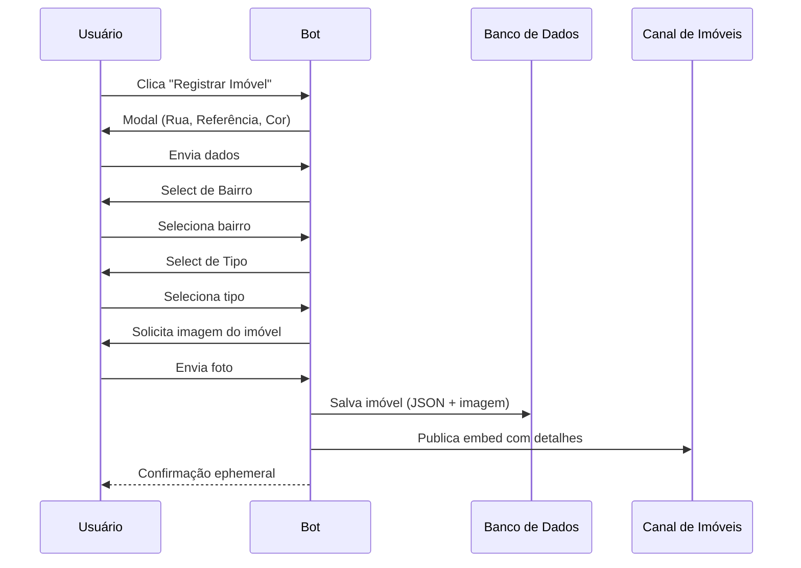

<p align="center">
  
</p>

<p align="center">
  
  
  
  
  
</p>

<br>

<h1 align="center">🏠 𝙰𝚝𝚕𝚊𝚜 𝚁𝙿 • 𝙱𝙾𝚃</h1>

<p align="center">
  Sistema de registro de imóveis para servidores de Roleplay – gerencie propriedades, gangues e ações policiais.
</p>

<p align="center">
  <b>𝙼𝚊𝚍𝚎 𝙱𝚢 𝚈𝟸𝚔_𝙽𝚊𝚝</b>
</p>

---

## ✦ 𝙰𝙱𝙾𝚄𝚃

> O **Atlas RP • BOT** é um sistema completo para servidores de Roleplay, desenvolvido em **Node.js + discord.js v14**. Ele permite o cadastro de imóveis com validação de dados, gerenciamento de status, gangues, ações policiais e backup automático.

---

## ✦ 𝙵𝙴𝙰𝚃𝚄𝚁𝙴𝚂

```txt
🏠 PROPERTY REGISTER  → Cadastro de imóveis com foto
📍 LOCATION SYSTEM    → Bairros definidos (Greenville, Brookemere, Horton)
🏷️ TYPE SYSTEM        → Casa, Apartamento, Comércio, Delegacia, Autódromo e Outro
📝 RP STATUS          → Disponível, Em Construção, Abandonada, Em Reforma
💥 GANG SYSTEM        → Criação, membros, propriedades vinculadas
👮 POLICE ACTIONS     → Interdição, Investigação, Liberação (com cargos configuráveis)
🎭 RP ACTIONS         → Registro de invasão com notificação ao dono
📊 STATISTICS         → Totais por bairro e tipo, ranking de gangues
📁 BACKUP             → Automático a cada alteração + manual
```

---

✦ 𝚂𝚈𝚂𝚃𝙴𝙼 𝙵𝙻𝙾𝚆



---

## ✦ 𝘾𝙊𝙈𝙈𝘼𝙉𝘿𝙎

### 🤖 Slash (Owner)

| Comando | Descrição |
|---------|-----------|
| `/houseregister #canal` | Define o canal do botão de registro |
| `/housechannel #canal` | Define o canal onde os imóveis aparecem |

---

### 📋 Consultas

| Comando | Descrição |
|---------|-----------|
| `;help` | Central de ajuda completa |
| `;list [bairro]` | Lista imóveis (filtro opcional por bairro) |
| `;search <termo>` | Busca imóvel por rua ou ID |
| `;info <id>` | Detalhes de um imóvel específico |
| `;stats` | Estatísticas gerais do servidor |
| `;neighborhoods` | Lista os bairros disponíveis |
| `;minhasprops` | Seus próprios imóveis registrados |
| `;vizinhanca <bairro>` | Imóveis de um bairro específico |

### 📝 Status RP

| Comando | Descrição |
|---------|-----------|
| `;status <id> <status>` | Altera status (disponivel/construcao/abandonada/reforma) |
| `;reformar <id>` | Atalho para "Em Reforma" |
| `;abandonar <id>` | Atalho para "Abandonada" |

### 💥 Gangues

| Comando | Descrição | Permissão |
|---------|-----------|-----------|
| `;gangue criar <nome> <@dono>` | Cria uma gangue | Owner |
| `;gangue deletar <nome>` | Deleta uma gangue | Owner |
| `;gangue info <nome>` | Informações da gangue | — |
| `;gangue list` | Lista todas as gangues | — |
| `;gangue vincular <id> <gangue>` | Vincula imóvel à gangue | Dono da gangue |
| `;gangue desvincular <id>` | Remove vínculo do imóvel | Dono da gangue |
| `;gangue membro add <@user> <gangue>` | Adiciona membro | Dono da gangue |
| `;gangue membro remove <@user> <gangue>` | Remove membro | Dono da gangue |
| `;gangue propriedades <nome>` | Lista imóveis da gangue | — |

### 👮 Polícia

| Comando | Descrição | Permissão |
|---------|-----------|-----------|
| `;policia cargo add @cargo` | Adiciona cargo policial | Owner |
| `;policia cargo remove @cargo` | Remove cargo policial | Owner |
| `;policia cargos` | Lista cargos policiais | — |
| `;interditar <id> <motivo>` | Interdita um imóvel | Policial |
| `;investigar <id>` | Coloca sob investigação | Policial |
| `;liberar <id>` | Libera imóvel interditado | Policial |

### 🎭 Ações RP

| Comando | Descrição |
|---------|-----------|
| `;invadir <id>` | Registra invasão e notifica o dono |

### 🔧 Administrativo (Owner)

| Comando | Descrição |
|---------|-----------|
| `;delete <id>` | Remove um imóvel do sistema |
| `;backup create` | Cria backup manual |
| `;backup list` | Lista backups disponíveis |
| `;export` | Exporta todos os dados em JSON |

---

✦ 𝙋𝙀𝙍𝙈𝙄𝙎𝙎𝙄𝙊𝙉𝙎

👑 DONO DO BOT
✔ Slash commands
✔ Gerenciar gangues e cargos policiais
✔ Deletar imóveis e fazer backup

👮 POLÍCIA (cargos configurados)
✔ Interditar / Investigar / Liberar imóveis

💥 DONO DE GANGUE
✔ Vincular / desvincular imóveis
✔ Gerenciar membros

🏠 USUÁRIOS COMUNS
✔ Registrar imóveis
✔ Alterar status dos próprios imóveis
✔ Invadir (RP)

---

✦ 𝘿𝘼𝙏𝘼𝘽𝘼𝙎𝙀

📁 data/imoveis/ – JSON por tipo de imóvel
📁 data/configs/ – Configurações por servidor e cargos
📁 data/backups/ – Backups automáticos (7 dias)
📁 logs/ – Logs diários de ações

✔ Leve
✔ Persistente
✔ Fácil manutenção

---

✦ 𝙊𝘽𝙅𝙀𝘾𝙏𝙄𝙑𝙀

✔ Automatizar o registro imobiliário RP
✔ Fornecer ferramentas para polícia e gangues
✔ Manter um ambiente organizado e imersivo
✔ Permitir consultas e estatísticas em tempo real

---

📌 Status

🟢 Online • ⚡ Estável • 🔒 Seguro

---

<p align="center">
  <b>© 2026 Atlas • 𝙼𝚊𝚍𝚎 𝙱𝚢 𝚈𝟸𝚔_𝙽𝚊𝚝</b>
</p>