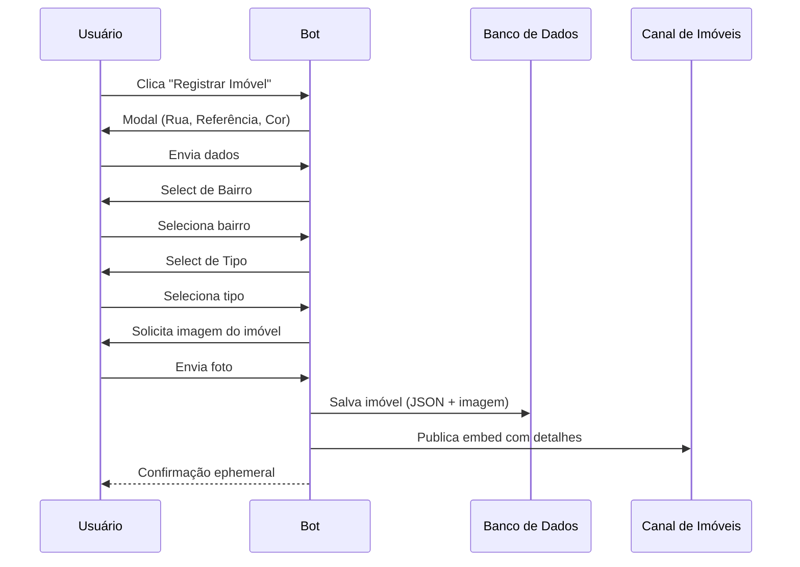

<p align="center">
  
  
  
  
  
</p>

<br>

<h1 align="center">🏠 𝙰𝚝𝚕𝚊𝚜 𝚁𝙿 • 𝙱𝙾𝚃</h1>

<p align="center">
  Sistema de registro de imóveis para servidores de Roleplay – gerencie propriedades, gangues e ações policiais.
</p>

<p align="center">
  <b>𝙼𝚊𝚍𝚎 𝙱𝚢 𝚈𝟸𝚔_𝙽𝚊𝚝</b>
</p>

---

## ✦ 𝙰𝙱𝙾𝚄𝚃

> O **Atlas RP • BOT** é um sistema completo para servidores de Roleplay, desenvolvido em **Node.js + discord.js v14**. Ele permite o cadastro de imóveis com validação de dados, gerenciamento de status, gangues, ações policiais e backup automático.

---

## ✦ 𝙵𝙴𝙰𝚃𝚄𝚁𝙴𝚂

```txt
🏠 PROPERTY REGISTER  → Cadastro de imóveis com foto
📍 LOCATION SYSTEM    → Bairros definidos (Greenville, Brookemere, Horton)
🏷️ TYPE SYSTEM        → Casa, Apartamento, Comércio, Delegacia, Autódromo e Outro
📝 RP STATUS          → Disponível, Em Construção, Abandonada, Em Reforma
💥 GANG SYSTEM        → Criação, membros, propriedades vinculadas
👮 POLICE ACTIONS     → Interdição, Investigação, Liberação (com cargos configuráveis)
🎭 RP ACTIONS         → Registro de invasão com notificação ao dono
📊 STATISTICS         → Totais por bairro e tipo, ranking de gangues
📁 BACKUP             → Automático a cada alteração + manual
```

---

✦ 𝚂𝚈𝚂𝚃𝙴𝙼 𝙵𝙻𝙾𝚆



---

✦ 𝘾𝙊𝙈𝙈𝘼𝙉𝘿𝙎

Slash Commands (Owner)

/houseregister #canal – Configura o canal do botão de registro

/housechannel #canal – Configura o canal dos imóveis registrados

Comandos de Prefixo ;

Imóveis:
;help – Central de ajuda
;list [bairro] – Lista imóveis
;search <termo> – Busca por rua/ID
;info <id> – Detalhes do imóvel
;stats – Estatísticas do servidor
;neighborhoods – Bairros disponíveis
;minhasprops – Seus imóveis
;vizinhanca <bairro> – Imóveis do bairro

Status RP:
;status <id> <status> – Altera status
;reformar <id> / ;abandonar <id> – Atalhos

Gangues:
;gangue criar <nome> <@dono> (Owner)
;gangue deletar <nome> (Owner)
;gangue info <nome>
;gangue list
;gangue vincular <id> <gangue> (Dono)
;gangue desvincular <id> (Dono)
;gangue membro add|remove <@user> <gangue>
;gangue propriedades <nome>

Polícia:
;policia cargo add @cargo (Owner)
;policia cargo remove @cargo (Owner)
;policia cargos
;interditar <id> <motivo> (Polícia)
;investigar <id> (Polícia)
;liberar <id> (Polícia)

Ações RP:
;invadir <id> – Registra invasão e notifica dono

Admin:
;delete <id> – Remove imóvel (Owner)
;backup create|list – Gerenciar backups (Owner)
;export – Exportar dados (Owner)

---

✦ 𝙋𝙀𝙍𝙈𝙄𝙎𝙎𝙄𝙊𝙉𝙎

👑 DONO DO BOT
✔ Slash commands
✔ Gerenciar gangues e cargos policiais
✔ Deletar imóveis e fazer backup

👮 POLÍCIA (cargos configurados)
✔ Interditar / Investigar / Liberar imóveis

💥 DONO DE GANGUE
✔ Vincular / desvincular imóveis
✔ Gerenciar membros

🏠 USUÁRIOS COMUNS
✔ Registrar imóveis
✔ Alterar status dos próprios imóveis
✔ Invadir (RP)

---

✦ 𝘿𝘼𝙏𝘼𝘽𝘼𝙎𝙀

📁 data/imoveis/ – JSON por tipo de imóvel
📁 data/configs/ – Configurações por servidor e cargos
📁 data/backups/ – Backups automáticos (7 dias)
📁 logs/ – Logs diários de ações

✔ Leve
✔ Persistente
✔ Fácil manutenção

---

✦ 𝙊𝘽𝙅𝙴𝘾𝙏𝙄𝙑𝙀

✔ Automatizar o registro imobiliário RP
✔ Fornecer ferramentas para polícia e gangues
✔ Manter um ambiente organizado e imersivo
✔ Permitir consultas e estatísticas em tempo real

---

📌 Status

🟢 Online • ⚡ Estável • 🔒 Seguro

---

<p align="center">
  <b>© 2026 Atlas RP • 𝙼𝚊𝚍𝚎 𝙱𝚢 𝚈𝟸𝚔_𝙽𝚊𝚝</b>
</p>
```